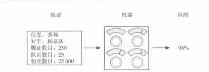
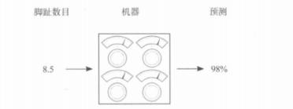
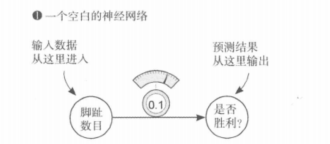
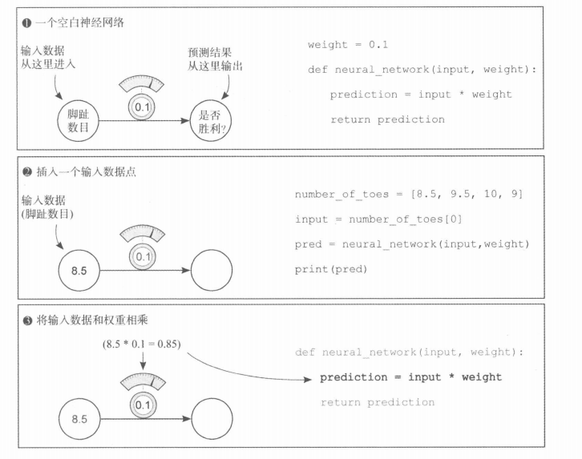
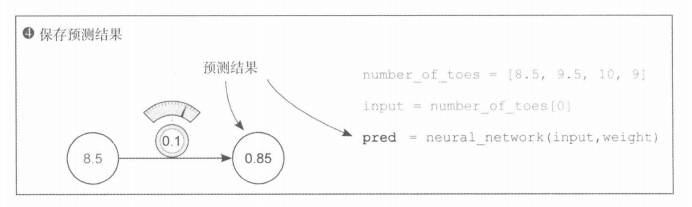

# 《深度学习图解》第3章 神经网络预测导论：前向传播
## 3.2 能够进行预测的简单神经网络

### 一、本章核心目标
从零搭建全世界最简单的神经网络，直观理解神经网络预测的最底层原理，建立前向传播的基础认知。



---

### 二、什么是最简单的神经网络
1. **核心本质**
仅由 1个输入 + 1个权重（旋钮） + 1个输出 构成
基础公式：
`预测结果 = 输入数据 × 权重(weight)`



2. **关键名词解释**
- 权重（weight）：书中比喻的「调节旋钮」，是神经网络里唯一可以调整、用来改变预测结果的参数
- 输入数据：现实世界采集来的原始数值（本例为球员平均脚趾数目 8.5）
- 预测：数据经过权重计算后，模型给出的最终输出结果



---

### 三、完整示例代码


```python
# 1. 手动设定权重（旋钮初始值）
weight = 0.1

# 2. 定义最简单的神经网络
def neural_network(input, weight):
    prediction = input * weight
    return prediction

# 3. 准备输入数据
number_of_toes = [8.5, 9.5, 10, 9]
input = number_of_toes[0]  # 取出第一个数据：8.5

# 4. 运行神经网络，完成预测
pred = neural_network(input, weight)

# 5. 输出结果
print(pred)  # 输出：0.85
```



> **记法衔接：** 推广到多输入、矩阵形式后，书中与仓库代码统一为「**权重矩阵在左、输入列向量在右**」（与 **y = W·x** 同构），详见 `07_3.9_多输入多输出_向量矩阵乘法.md` **第七节**。