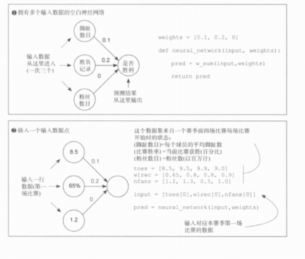
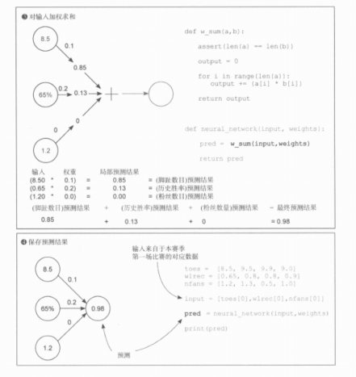

# 《深度学习图解》第3章 · 3.5 多个输入与加权求和

> **合并更新备忘：** 在书中 3.5 基础上，把「单输入 → 多输入」的动机、公式、权重含义、可运行代码与对比表收拢到本篇，并与下方插图、数表对照阅读。

## 3.5 核心结论（先记一句）

多输入时，**每个输入各自乘上对应权重，再把结果加起来**，得到最终预测。即输入向量与权重向量的**加权求和**（与点积同形）。

---

## 一、模型升级：从单输入 → 多输入神经网络

### 核心逻辑

单输入网络只能用 1 个特征预测结果，现实问题需要**同时融合多个特征信息**，因此扩展为**多输入加权求和**模型。

本次案例 3 个输入特征：

- 脚趾数目
- 历史胜负记录
- 粉丝数目

---

## 二、数学公式

多输入神经网络 = **每个输入 × 对应权重，全部相加求和**：

`prediction = input_1 × w_1 + input_2 × w_2 + input_3 × w_3`

### 本次案例计算

输入：`[8.5, 0.65, 1.2]`  
权重：`[0.1, 0.2, 0]`

8.5×0.1 + 0.65×0.2 + 1.2×0 = 0.85 + 0.13 + 0 = **0.98**

---

## 三、书中示意图：多输入空白网络与一条样本



要点：

- 三个输入可对应：**脚趾数目**、**胜负记录**、**粉丝数目**（书中示例特征）。
- 权重示例：`[0.1, 0.2, 0]`。其中 **粉丝项权重为 0** 表示该路贡献恒为 0，相当于**暂时忽略**这一特征。
- 取向量 `[toes[0], wlrec[0], nfans[0]]`，与第一场比赛对齐。

---

## 四、加权求和与保存预测



计算示例（与图一致）：

| 特征     | 输入   | 权重 | 部分积   |
|----------|--------|------|----------|
| 脚趾     | 8.5    | 0.1  | 0.85     |
| 胜负记录 | 0.65   | 0.2  | 0.13     |
| 粉丝     | 1.2    | 0    | 0        |

**预测** = 0.85 + 0.13 + 0 = **0.98**

代码上即用 `w_sum(input, weights)` 实现「对应相乘再相加」，再交给网络函数得到 `pred`。

---

## 五、权重的深层意义

1. **每个特征独立重要性**
   - 权重越大 → 该特征对预测结果影响越大
   - 权重 = 0 → 该特征完全不参与预测，模型直接忽略此信息  
   本例粉丝权重 = 0，说明该特征对比赛胜负无预测价值（书中设定）。
2. **依旧保留「信号旋钮」特性**
   - 正负权重控制特征与结果的正负相关性
   - 数值大小控制特征影响强弱
3. **网络无记忆性**  
   依然只处理当前单次输入行（向量）数据，不保存历史批次信息。

---

## 六、完整 Python 代码（合并前后所有逻辑）

```python
def w_sum(a, b):
    assert len(a) == len(b)
    output = 0
    for i in range(len(a)):
        output += a[i] * b[i]
    return output


def neural_network_single(x, weight):
    prediction = x * weight
    return prediction


def neural_network_multi(input_vec, weights):
    pred = w_sum(input_vec, weights)
    return pred


# 数据集
toes = [8.5, 9.5, 9.9, 9.0]
wlrec = [0.65, 0.8, 0.8, 0.9]
nfans = [1.2, 1.3, 0.5, 1.0]

# 第一场比赛输入（避免使用内置名 input，故用 input_vec）
input_vec = [toes[0], wlrec[0], nfans[0]]
weights = [0.1, 0.2, 0]

print(neural_network_multi(input_vec, weights))  # 0.98
```

---

## 七、新旧模型对比总结

| 模型类型       | 输入数量 | 计算逻辑                 | 适用场景                 |
|----------------|----------|--------------------------|--------------------------|
| 单输入单层网络 | 1 个特征 | 输入 × 权重              | 极简入门、单一因素预测   |
| 多输入单层网络 | 多个特征 | 多组输入×权重后累加      | 多因素综合预测、线性拟合 |

---

## 八、底层本质

无论是单输入还是多输入，**全都是线性模型**：网络全程只做乘法与加法，没有非线性变换，仍是深度学习里最基础的底层单元。

---

## 九、与 3.2 的关系

- 单输入：`预测 = 输入 × 权重`。
- 多输入：`预测 = Σ (输入_i × 权重_i)`，是同一思想的直接推广。
