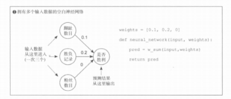
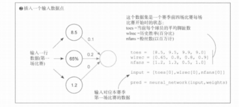
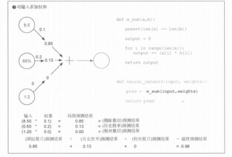
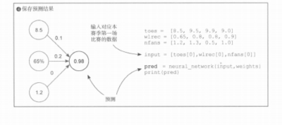

# 《深度学习图解》第3章 · 3.6 多输入神经网络：点积与前向传播

## 3.6 多个输入：神经网络的完整工作原理

### 一、本节核心定位

承接上一节单输入单权重神经网络，完成**从单一特征 → 多特征综合预测**的升级，是所有现代深度学习、全连接网络、前向传播运算的底层基石，完整拆解多输入场景下神经网络推理的全过程。

---

### 二、本节开篇引入

之前最简单的神经网络，只有 1 个输入、1 个权重旋钮，预测能力非常局限，仅凭单一数据无法做出靠谱判断。

想要预测更精准，神经网络就必须**一次性接收、融合多个不同来源的输入信息**，本节就讲解这个多输入模型的完整实现逻辑。

---

### 三、核心概念定义

1. **向量**：本质就是一组有序数字列表
   - **输入向量**：把多个独立特征打包成的一组数据
   - **权重向量**：为每一个输入特征，单独分配的专属权重集合
2. **逐元素乘法**：两个长度相等的向量，**相同位置的数值一对一配对相乘**
3. **加权和 / 点积（内积）**  
   先完成逐元素相乘，再把所有乘积结果全部累加求和，这就是多输入神经网络的核心计算。写成通式就是：**预测输出 = 各下标 i 上 `input_i × weight_i` 全部加起来的和**（书中记作对 i 求和的那一种点积/加权和）。

> **与代码一致的记法：** 多路特征写成列向量 **x**、单行权重看作 **W** 的一行时，「点积再求和」就是 **W 的这一行在左、x 在右** 相乘后求和；多输出时 **W** 为多行矩阵，整体即 **y = W·x**（**权重矩阵在左，输入列向量在右**）。框架里「样本行在左」的写法可通过对 **W** 转置等与上式对齐，详见 `07_3.9_多输入多输出_向量矩阵乘法.md` **第七节**。

4. **前向传播**：从原始输入数据进入网络，经过权重加权计算，最终输出预测结果的完整单向推理流程。

---

### 四、模型基础结构

- 本次 3 个输入特征：
  1. 球员脚趾平均数量
  2. 队伍历史比赛胜负胜率
  3. 球队粉丝总人数
- 权重向量：`weights = [0.1, 0.2, 0]`
- 基础逻辑伪代码：

```python
weights = [0.1, 0.2, 0]

def neural_network(input_vec, weights):
    pred = w_sum(input_vec, weights)
    return pred
```

**不变的底层机制**：权重依然是每个特征独立的「音量旋钮」，单独放大/缩小对应输入对结果的影响；多输入只是同时开启了多个旋钮，再把所有效果叠加。



---

### 五、案例场景与原始数据集

数据集来自赛季前 4 场比赛、开赛时的队伍状态数据：

```python
# 球员平均脚趾数量
toes = [8.5, 9.5, 9.9, 9.0]
# 队伍历史胜率
wlrec = [0.65, 0.8, 0.8, 0.9]
# 粉丝数量（以百万计）
nfans = [1.2, 1.3, 0.5, 1.0]

# 本赛季第一场比赛的全部特征作为输入向量（避免覆盖内置 input，用 input_vec）
input_vec = [toes[0], wlrec[0], nfans[0]]
# [8.5, 0.65, 1.2]
```



---

### 六、完整分步计算过程



1. **逐特征加权相乘（局部预测）**
   - 脚趾特征：`8.5 × 0.1 = 0.85`
   - 胜率特征：`0.65 × 0.2 = 0.13`
   - 粉丝特征：`1.2 × 0 = 0`（权重为 0，该特征完全被模型忽略，不影响结果）

2. **全部局部结果求和（加权和 / 点积）**

0.85 + 0.13 + 0 = **0.98**

3. **最终神经网络预测输出：0.98**



---

### 七、点积的深层直觉理解

1. **向量相似度衡量**
   - 输入向量与权重向量方向越匹配、对齐度越高，点积结果越高
   - 两个向量完全无关、无重合匹配，点积结果趋近于 0
   - 负权重可以抵消正向特征贡献，拉低整体预测得分

2. **可类比基础逻辑运算**

| 权重设置 | 近似逻辑含义 |
|----------|----------------|
| 正权重 | AND 与逻辑：特征匹配则正向加分 |
| 任意位置权重非 0 | OR 或逻辑：任意一个特征都会影响最终分数 |
| 负权重 | NOT 非逻辑：输入越大结果越低；负负相乘则反向加分 |

3. **权重逻辑示例**

```python
weights = [1, 0, 1]    # 第 0 或第 2 个特征值大 → 易获高分
weights = [0, 0, 1]    # 仅第 2 个特征影响预测
weights = [1, 0, -1]   # 第 0 个值高 或 第 2 个值低 → 高分
weights = [-1, 0, -1]  # 第 0 个值低 或 第 2 个值低 → 高分
weights = [0.5, 0, 1]  # 部分权重偏小，需更大输入才能补足影响力
```

---

### 八、权重核心特性

1. 权重顺序绝对不能打乱，必须和输入特征的位置严格一一对应
2. 单特征最终影响力 = `输入数值 × 权重数值`
3. 哪怕权重本身数值不大，只要对应输入数值足够高，依然可以主导最终预测结果
4. 权重 = 0：直接屏蔽、忽略该特征，该特征完全不参与预测计算
5. 负权重特性：输入数值越大，预测结果越小；输入越小，预测结果越大

---

### 九、神经网络通用本质（通用真理）

所有神经网络，界面与底层逻辑永远保持一致：

- **输入变量**：外界给到模型的原始信息、数据
- **权重变量**：模型提前学习、存储下来的经验与知识
- **输出预测**：信息 + 知识融合之后，模型给出的最终判断

---

### 十、完整可运行 Python 代码

```python
def w_sum(a, b):
    assert len(a) == len(b)
    output = 0
    for i in range(len(a)):
        output += a[i] * b[i]
    return output


def neural_network(input_vec, weights_vec):
    prediction = w_sum(input_vec, weights_vec)
    return prediction


if __name__ == "__main__":
    toes = [8.5, 9.5, 9.9, 9.0]
    wlrec = [0.65, 0.8, 0.8, 0.9]
    nfans = [1.2, 1.3, 0.5, 1.0]

    weights = [0.1, 0.2, 0]
    input_data = [toes[0], wlrec[0], nfans[0]]

    pred = neural_network(input_data, weights)
    print(f"本场比赛最终预测结果：{pred:.2f}")
```

---

### 十一、本节章节总结

1. 弥补了单输入模型只能用单一因素判断的短板，支持多维度信息综合决策
2. 正式引入**向量、加权和、点积、前向传播**四个深度学习最基础核心概念
3. 基础原理和单输入网络完全一脉相承，仅做了多路输入的能力扩展
4. 全程为纯线性运算，无记忆、无非线性激活，是后续深层网络、复杂模型的底层原型
