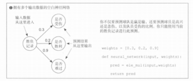
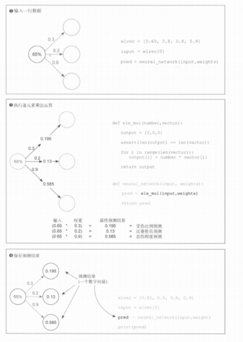

# 《深度学习图解》第3章 · 3.8 单输入多输出与逐元素乘法

## 3.8 预测多个输出

### 一、本节核心定位

在前文**多输入单输出**基础上，扩展为**单输入、多输出**神经网络，是前向传播的又一种基础形态；与「多路特征压成一个数」相比，这里是「一路特征拆成多个预测」。

---

### 二、模型核心原理

1. **结构本质**  
   同一个输入同时接**多组独立权重**，每组对应一个预测，等价于**多个单输入单输出子网络共用同一标量输入**；各输出彼此独立，没有再加总成一个标量。

2. **本次案例**  
   - 唯一输入：队伍历史胜负胜率 `0.65`（取 `wlrec[0]`）  
   - 三个输出：受伤比例、比赛胜负、难过程度（书中示意）  
   - 权重向量：`weights = [0.3, 0.2, 0.9]`

3. **运算：逐元素乘法（标量 × 向量）**  
   标量与权重向量**逐位相乘**，直接得到输出向量（不做求和）：

- `0.65 × 0.3 = 0.195`（受伤相关预测）
- `0.65 × 0.2 = 0.13`（胜负相关预测）
- `0.65 × 0.9 = 0.585`（情绪相关预测）

---

### 三、书中示意图





---

### 四、原生 Python 完整代码

```python
def ele_mul(number, vector):
    output = [0] * len(vector)
    for i in range(len(vector)):
        output[i] = number * vector[i]
    return output


def neural_network(input_scalar, weights):
    pred = ele_mul(input_scalar, weights)
    return pred


wlrec = [0.65, 0.8, 0.8, 0.9]
weights = [0.3, 0.2, 0.9]

input_scalar = wlrec[0]
pred = neural_network(input_scalar, weights)
print(pred)
# [0.195, 0.13, 0.585]
```

---

### 五、NumPy 极简代码

```python
import numpy as np

weights = np.array([0.3, 0.2, 0.9])


def neural_network(input_scalar, weights):
    return input_scalar * weights


wlrec = np.array([0.65, 0.8, 0.8, 0.9])
input_scalar = wlrec[0]
print(neural_network(input_scalar, weights))
```

标量与一维 `ndarray` 相乘时，NumPy 按**广播**逐元素相乘，与手写 `ele_mul` 一致。

---

### 六、多输入单输出 VS 单输入多输出

| 模型类型     | 输入维度 | 输出维度 | 核心运算           | 特点                         |
|--------------|----------|----------|--------------------|------------------------------|
| 多输入单输出 | 特征向量 | 单个数   | 点积（乘后求和）   | 多信息融合为一个结果         |
| 单输入多输出 | 单个数   | 向量     | 标量与向量逐位相乘 | 单一信息，多任务各自一个输出 |

---

### 七、关键总结

1. 多输出这一形态可看成 **N 路独立权重** 共用同一输入，前向时**不必**把各路再加成一项。  
2. 实现核心是 **`ele_mul`**（或 NumPy 广播），再包一层 **`neural_network`**。  
3. 输出是**向量**，每一维对应一个预测任务。  
4. 仍是无激活的线性前向，与后文权重矩阵、全连接层衔接。
