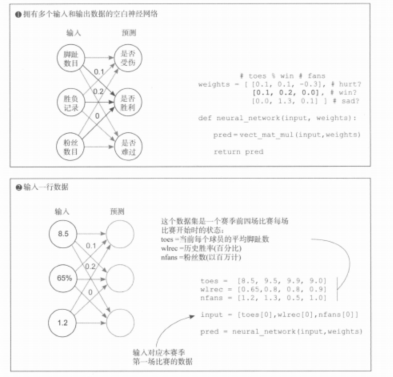
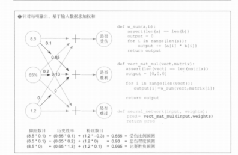

# 《深度学习图解》第3章 · 3.10 多输入多输出神经网络：矩阵运算

## 3.10 多输入多输出神经网络的工作原理

### 一、本节核心定位

整合前面所有模型：**多输入 + 多输出**完整神经网络，正式引入**向量、矩阵、向量–矩阵乘法**，是全连接层、更深层网络的前向运算原型。

> **与代码一致的记法：** 列向量 **x**、权重矩阵 **W**（每行一个输出头）时，**y = W·x**：**权重在乘号左边，输入在右边**。下文 `vect_mat_mul` 即对 **W** 的每一行与 **x** 做点积。与框架「样本行在左」写法的关系见 `07_3.9_多输入多输出_向量矩阵乘法.md` **第七节**。

---

### 二、模型结构与场景

1. **输入（3 个特征）**  
   脚趾数目、历史胜负胜率、粉丝数目。示例输入向量：`[8.5, 0.65, 1.2]`。

2. **输出（3 个独立预测）**  
   是否受伤、是否胜利、队员难过程度（书中多任务示意）。

3. **权重结构**  
   每个输出对应一整行与输入维度相同的权重；多行叠在一起就是**权重矩阵**：

```python
weights = [
    [0.1, 0.2, 0],    # 受伤预测
    [0.1, 0.2, 0.1],  # 胜负预测
    [0.0, 0.3, 0.1],  # 情绪预测
]
```

---

### 三、书中示意图（与 3.9 同一类结构）

插图与 **3.9** 共用，表示「全连接一层、多路输出」的画法；**具体数字以本节第二节、第四节权重与手算为准**（原书图上矩阵元素可能与练习矩阵不同）。





---

### 四、运算原理

1. **本质：对权重矩阵的每一行各做一次向量点积**  
   输入向量与**第 i 行**权重做点积，得到第 i 个输出。

   用上面这组 `weights` 与 `x = [8.5, 0.65, 1.2]` 手算：

   - 受伤：`8.5×0.1 + 0.65×0.2 + 1.2×0 = 0.85 + 0.13 + 0 = **0.98**`
   - 胜负：`8.5×0.1 + 0.65×0.2 + 1.2×0.1 = 0.85 + 0.13 + 0.12 = **1.10**`
   - 难过：`8.5×0.0 + 0.65×0.3 + 1.2×0.1 = 0 + 0.195 + 0.12 = **0.315**`

2. **名称**  
   一行输入向量与二维权重矩阵按「行点积」规则相乘，得到一行输出向量（与线性代数里 **y = xW** 的一种布局对应，具体行列约定以实现代码为准）。

3. **结构理解**  
   可看成 **3 个「多输入单输出」子网络并行**，共用同一个输入向量。

---

### 五、原生 Python 实现

```python
def w_sum(a, b):
    assert len(a) == len(b)
    output = 0
    for i in range(len(a)):
        output += a[i] * b[i]
    return output


def vect_mat_mul(vect, matrix):
    assert len(vect) == len(matrix[0])
    output = []
    for row in matrix:
        output.append(w_sum(vect, row))
    return output


def neural_network(input_vec, weights_matrix):
    return vect_mat_mul(input_vec, weights_matrix)


toes = [8.5, 9.5, 9.9, 9.0]
wlrec = [0.65, 0.8, 0.8, 0.9]
nfans = [1.2, 1.3, 0.5, 1.0]

weights = [
    [0.1, 0.2, 0],
    [0.1, 0.2, 0.1],
    [0.0, 0.3, 0.1],
]

input_vec = [toes[0], wlrec[0], nfans[0]]
print(neural_network(input_vec, weights))
# [0.98, 1.1, 0.315]
```

---

### 六、四种基础形态对照

| 网络形态     | 输入结构 | 输出结构 | 核心运算           |
|--------------|----------|----------|--------------------|
| 单输入单输出 | 标量     | 标量     | 标量 × 标量        |
| 多输入单输出 | 向量     | 标量     | 向量点积（再求和） |
| 单输入多输出 | 标量     | 向量     | 标量与向量逐位相乘 |
| 多输入多输出 | 向量     | 向量     | 向量 × 矩阵（按行点积） |

---

### 七、3.11 进阶预告：网络堆叠

- 上一层的**输出向量**可作为下一层的**输入向量**。
- 前向过程就是多次「向量–矩阵」类运算（以及日后加入的激活、偏置等）串联起来。
- 多层堆叠即**深度神经网络**的基本构造思路；复杂任务往往依赖多层表达。

---

### 八、核心概念小结

1. 多行权重按行排列 → **矩阵**。  
2. 多输入多输出的一层线性前向 = 输入向量与权重矩阵的**按行点积**（手写即 `vect_mat_mul`）。  
3. 这一层仍是线性运算（乘加）；更深、更丰富的行为来自层数、宽度、激活与训练。  
4. **堆叠多层** = 前向中多次矩阵类运算与后续非线性组合，构成深度学习的主体框架。
