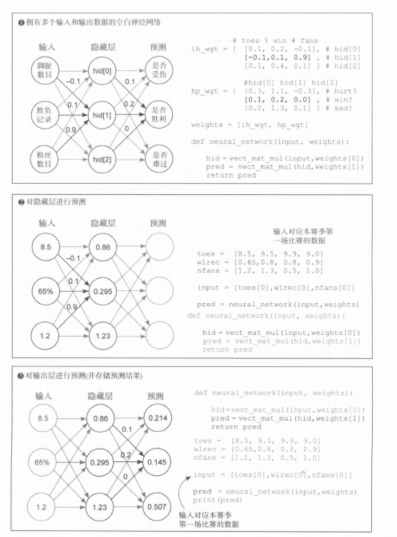

# 《深度学习图解》第3章 · 3.11 带隐层的前向传播（3-3-3 网络）

## 3.11 一层隐层：输入 → 隐层 → 多输出

在「多输入多输出、单层矩阵乘法」之上再叠一层：**先用输入向量与矩阵 `ih_wgt` 得到隐层向量 `hid`，再用 `hid` 与矩阵 `hp_wgt` 得到最终预测向量**。前向仍是连续的线性乘加（书中此阶段尚未引入激活函数）。

> **与代码一致的记法：** 每一层仍是 **y = W·x**（**权重矩阵在左，该层输入列向量在右**）：`hid = ih_wgt · x`，`pred = hp_wgt · hid`（代码里即两次 `vect_mat_mul`）。与框架行向量约定、转置关系见 `07_3.9_多输入多输出_向量矩阵乘法.md` **第七节**。

---

### 一、书中示意图



---

### 二、结构约定（与图一致）

- **输入 3 维**：脚趾数目、胜负记录、粉丝数 → 示例 `input_vec = [8.5, 0.65, 1.2]`。  
- **隐层 3 维**：`hid[0]`、`hid[1]`、`hid[2]`，由输入与 **输入–隐层权重** `ih_wgt` 按行点积得到。  
- **输出 3 维**：受伤、胜利、难过等预测，由 `hid` 与 **隐层–输出权重** `hp_wgt` 按行点积得到。  

权重矩阵**每一行**对应**一个**隐单元或一个输出头，**列**与上一层维度对齐。

```python
# 输入 → 隐层（每行对应一个 hid[i]）
ih_wgt = [
    [0.1, 0.2, -0.1],
    [-0.1, 0.1, 0.9],
    [0.1, 0.4, 0.1],
]

# 隐层 → 输出（每行对应一个预测头）
hp_wgt = [
    [0.3, 1.1, -0.3],
    [0.1, 0.2, 0.0],
    [0.0, 1.3, 0.1],
]
```

---

### 三、手算校验（与图一致）

**隐层**（输入与 `ih_wgt` 各行点积）：

- `hid[0] = 8.5×0.1 + 0.65×0.2 + 1.2×(−0.1) = 0.86`
- `hid[1] = 8.5×(−0.1) + 0.65×0.1 + 1.2×0.9 = 0.295`
- `hid[2] = 8.5×0.1 + 0.65×0.4 + 1.2×0.1 = 1.23`

**输出**（`hid` 与 `hp_wgt` 各行点积）：

- 受伤相关：`0.86×0.3 + 0.295×1.1 + 1.23×(−0.3) ≈ 0.214`
- 胜负相关：`0.86×0.1 + 0.295×0.2 + 1.23×0 ≈ 0.145`
- 情绪相关：`0.86×0 + 0.295×1.3 + 1.23×0.1 ≈ 0.507`

---

### 四、完整可运行代码

```python
def w_sum(a, b):
    assert len(a) == len(b)
    output = 0
    for i in range(len(a)):
        output += a[i] * b[i]
    return output


def vect_mat_mul(vect, matrix):
    assert len(vect) == len(matrix[0])
    return [w_sum(vect, row) for row in matrix]


def neural_network(input_vec, ih_wgt, hp_wgt):
    hid = vect_mat_mul(input_vec, ih_wgt)
    pred = vect_mat_mul(hid, hp_wgt)
    return pred


ih_wgt = [
    [0.1, 0.2, -0.1],
    [-0.1, 0.1, 0.9],
    [0.1, 0.4, 0.1],
]
hp_wgt = [
    [0.3, 1.1, -0.3],
    [0.1, 0.2, 0.0],
    [0.0, 1.3, 0.1],
]

toes = [8.5, 9.5, 9.9, 9.0]
wlrec = [0.65, 0.8, 0.8, 0.9]
nfans = [1.2, 1.3, 0.5, 1.0]

input_vec = [toes[0], wlrec[0], nfans[0]]
pred = neural_network(input_vec, ih_wgt, hp_wgt)
print(pred)
# 约 [0.2135, 0.145, 0.5065]，书中常四舍五入为 [0.214, 0.145, 0.507]
```

---

### 五、小结

1. **深度**在这里体现为：**两次**「向量 × 矩阵」（先得到 `hid`，再得到 `pred`）。  
2. 权重拆成 **`ih_wgt`** 与 **`hp_wgt`** 两块矩阵，与单层多输出相比只是多了一次 `vect_mat_mul`。  
3. 后续章节会在层间加入**激活函数、偏置**等，但「多层 = 多次线性块 + 非线性」的骨架与此一致。
