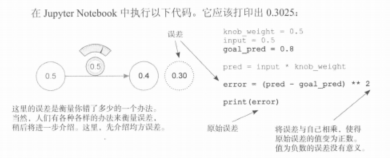

# 《深度学习图解》第4章 · 误差与均方误差（入门）

> **阅读顺序：** 建议先读 **`01_预测比较学习与梯度下降链路.md`**，再读本篇（插图与书中代码对应「比较」这一步）。

---

## 误差：衡量预测偏离目标的程度

图中流程：**输入 × 权重旋钮 → 预测**，再与**目标值**比较得到误差。这里先用**平方误差**：把「预测 − 目标」再**平方**，得到标量 **Loss**（恒非负，大偏差惩罚更重）。



**说明：** 示意图里预测有时画成约 **0.4**，是示意；**按书中代码**应为 **0.5×0.5 = 0.25**，打印的 **`0.3025`** 只能由 **(0.25−0.8)²** 得到，下文一律按代码演算。

---

## 一、跟着书本代码完整演算一遍

### 1. 已知参数

```python
knob_weight = 0.5   # 权重 w
x = 0.5             # 输入（书中变量名 input，此处用 x 以免覆盖内置 input）
goal_pred = 0.8     # 真实标签 y
```

### 2. 步骤 1：模型预测

**pred = x × knob_weight = 0.5 × 0.5 = 0.25**

### 3. 步骤 2：原始误差（未平方）

**e = pred − goal_pred = 0.25 − 0.8 = −0.55**

### 4. 步骤 3：平方误差（本段即 Loss）

**Loss = (pred − goal_pred)² = (−0.55)² = 0.3025**  

与书中运行 **`print(error)`** 打印的 **`0.3025`** 一致。

### 5. 与书中一致的代码

```python
knob_weight = 0.5
x = 0.5
goal_pred = 0.8

pred = x * knob_weight
error = (pred - goal_pred) ** 2

print(error)
```

---

## 二、书本要点（大白话）

### 1. 为什么要把误差再平方？

1. **符号统一**：偏高、偏低时「原始差」一正一负；平方后 Loss 为非负，大小才好比较。  
2. **大错重罚、小错轻罚**：例如 |e|=0.1 → e²=0.01；|e| 更大时平方涨得更快，梯度下降会更用力去拉离谱的预测。  
3. **光滑、好求导**：常见平方损失在简单模型下便于用梯度下降（是否「全局唯一最低点」还要看模型，这里不展开）。

### 2. 各变量在说什么？

| 符号 | 含义 |
|------|------|
| `x` | 输入特征 |
| `knob_weight` | 可调权重 w |
| `goal_pred` | 目标 / 标签 |
| `pred` | 前向得到的预测 ŷ |
| `error`（代码里） | 本例即 **平方后的 Loss**，不是「未平方的 e」 |

---

## 三、衔接梯度下降（本书下一步）

1. 现在只知道 **Loss = 0.3025**（错得有多严重）。  
2. 下一步：对 **Loss** 关于 **w** 求偏导。若 **Loss = (pred − y)²**（**没有**前面的 **½**），且 **pred = w·x**，则  
   **∂Loss/∂w = 2·(pred − y)·x**  
   （若写成 **Loss = ½(pred−y)²**，则前面多出的 **2** 会消掉，得到 **(pred−y)·x**；与 **`04`**、**`05`** 中的写法对齐即可。）  
3. 更新：**w_新 = w_旧 − η·(∂Loss/∂w)**，**η** 为学习率。  
4. 反复：预测 → Loss → 梯度 → 更新。

书中在梯度法之前介绍的**冷热试探更新**见 **`03_误差测量与冷热学习.md`**。更一般的链式与符号见 **`04_梯度下降_Loss与对权重求导.md`**；带数例题见 **`05_平方误差与对数损失_数值例题.md`**。

---

## 四、和前面概念对齐

- **pred − goal_pred**：原始差，可记作 **误差 e**。  
- **(pred − goal_pred)²**：本代码里的 **Loss**（平方误差；是否乘 **½** 只改梯度常数因子）。  
- **梯度下降**：永远对 **Loss** 关于**参数**求偏导，不是对「未平方的 e」单独当作优化目标。

---

## 五、一步权重更新（本书这组数）

取 **Loss = (pred − y)²**，**pred = w·x**，当前 **w = 0.5**，**x = 0.5**，**y = 0.8**，**η = 0.1**。

- **∂Loss/∂w = 2·(pred − y)·x = 2·(0.25 − 0.8)·0.5 = 2·(−0.55)·0.5 = −0.55**  
- **w_新 = 0.5 − 0.1·(−0.55) = 0.5 + 0.055 = 0.555**

一步之后权重略**增大**，与「pred 偏低、梯度为负时应增大 w 以降低平方损失」的直觉一致（局部一步；未验证多步收敛）。
