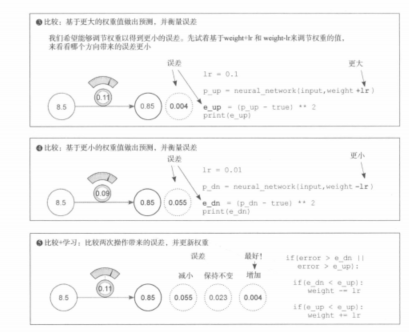

# 《深度学习图解》第4章 · 误差测量与冷热学习（4.5–4.7）

> 上接 **`02_误差与均方误差.md`**（平方损失与打印 **0.3025**）；本篇对应书中 **4.5 为何测误差**、**4.6 冷热学习**、**4.7 代码与逻辑**。与基于梯度的更新（**`04`–`05`**）对照阅读。

---

## 一、4.5 为什么需要测量误差？

### 1. 核心作用

把「网络好不好」压成一个标量 **Loss**，训练就变成：**调权重，让 Loss 下降**。比抽象地要求「误差立刻变零」更好落地；优化目标明确，才好设计更新规则。

### 2. 平方误差 vs 绝对误差（直观优先级）

- **平方（均方）误差**：大偏差平方后涨得更快，训练会更用力纠大错；小偏差平方后影响相对小。  
- **绝对误差**：|e| 上每 1 单位错罚 1 单位，**不按平方放大**大错的「优先级」。

### 3. 为什么要「恒正」的损失？

若只用有正有负的「原始差」做平均，**正负会抵消**：例如 +1000 与 −1000 平均为 0，但两次预测都很差。平方（或其它只依赖大小的形式）让贡献**不可互相抵消**，避免被平均数骗过去。

---

## 二、4.6 冷热学习（最朴素的试探更新）

### 1. 是什么

**冷热学习**：在当前权重附近，分别**试探**「略增大」「略减小」两个方向，看哪个方向的**平方误差更小**，就把权重往那边挪一小步；循环多次，误差逐步下降。

### 2. 单轮可概括为 5 步

1. 用当前 **weight** 算预测与 **Loss**。  
2. 试探 **weight + step**（热），算新 **Loss**。  
3. 试探 **weight − step**（冷），算新 **Loss**。  
4. 比较两步的 **Loss**，取更小的一侧更新 **weight**。  
5. 重复足够多轮（书中常用上千次量级演示）。

### 3. 本质

在**一维权重**上做的**局部搜索**：没有显式求导，但体现「**看误差往哪边走**」这一训练思想；可看作梯度下降的非常粗糙的**原型**（真正梯度法用导数指明方向，不必每步试两次前向）。

### 书中示意图：权重大/小试探与择优更新



图中各格 **`lr`** 与 **0.1 / 0.01** 可能与下一节统一代码的 **`step_amount`** 不完全一致，以你运行时的**单一学习率**为准；逻辑始终是：**两次试探的平方误差谁更小，权重就往哪边挪一步**。

---

## 三、4.7 完整可运行代码（已校对）

约定与 **`02`** 一致：**Loss = (预测 − 目标)²**，不要用 **(目标 − 预测)²** 混用符号（平方后数值一样，但和全书其它推导写法则统一为 **(pred − goal)²**）。

```python
weight = 0.5
x = 0.5  # 书中名 input，此处用 x
goal_prediction = 0.8
step_amount = 0.001

for iteration in range(1101):
    prediction = x * weight
    error = (prediction - goal_prediction) ** 2

    up_prediction = x * (weight + step_amount)
    up_error = (up_prediction - goal_prediction) ** 2

    down_prediction = x * (weight - step_amount)
    down_error = (down_prediction - goal_prediction) ** 2

    if down_error < up_error:
        weight -= step_amount
    elif down_error > up_error:
        weight += step_amount
    # 二者相等时可不更新
```

### 运行现象（与书一致）

- 起步：预测 **0.25**，Loss **0.3025**。  
- 多轮后：预测可逼近 **0.8**，Loss 趋近 **0**（步长、轮数与浮点实现会影响终点精度）。

### 优缺点

| 优点 | 缺点 |
|------|------|
| 逻辑极简，便于建立「误差驱动更新」直觉 | 每步两次额外前向，**极慢**；权重一多组合爆炸，**无法**当实用训练法 |

---

## 四、带日志的可运行脚本（可选）

每隔 200 轮打印一次，便于观察下降（轮数可按需改小做快速试验）：

```python
weight = 0.5
x = 0.5
goal = 0.8
step_amount = 0.001

for i in range(1101):
    pred = x * weight
    err = (pred - goal) ** 2

    up_e = (x * (weight + step_amount) - goal) ** 2
    dn_e = (x * (weight - step_amount) - goal) ** 2

    if dn_e < up_e:
        weight -= step_amount
    elif dn_e > up_e:
        weight += step_amount

    if i % 200 == 0 or i == 1100:
        print(f"iter={i:4d}  weight={weight:.6f}  pred={x*weight:.6f}  loss={err:.6f}")
```

---

## 五、与全章其它笔记的关系

1. **平方损失**：**`02`** 单点计算；本篇强调**为何**用它度量训练。  
2. **冷热学习**：无导数、**试两个方向**；**`04`–`05`** 用 **∂Loss/∂w** 与数值例题指明方向。  
3. 一句话：**训练以误差（损失）为导向，在权重空间里找更优点。**
