# 《深度学习图解》第4章 · 书例图解（4.11～4.23）

> **阅读顺序：**先读 **`04_梯度下降_Loss与对权重求导.md`** 中**第三～七节**（链式、拆开算、多权重、**`w ← w − ηg`**），再读本篇**代码 walkthrough 与书页图**。损失与 **0.3025** 见 **`02`**；冷热试探见 **`03`**。

---

## 一、4.11 梯度本质：极简代码、碗形曲线（配图）与手算

对应书中 **4.11** 前后：**固定样本时，Loss 是权重 w 上的碗；切线斜率即梯度；五代码行即一轮梯度下降骨架**。

### 1. 极简训练循环逐行对应什么

```python
pred = input * weight                  # 1. 前向：由当前 w 得到预测
error = (pred - goal_pred) ** 2        # 2. 比较：平方误差（单样本时常直接打印为「误差」）
delta = pred - goal_pred               # 3. 原始差（书中常叫 delta / 节点 delta）
weight_delta = delta * input           # 4. 与 ∂Loss/∂w 同型的一项（见下「½」约定）
weight = weight - weight_delta         # 5. 学习：沿其反方向走一步（等价 w ← w − η·∂Loss/∂w 的特例）
```

把 **2～5** 放进 `for` 里反复做，就是**最小版「预测 → 损失 → 梯度信息 → 更新」**。实战里常在 **5** 上乘学习率 **`alpha`**（**`η`**），并做批量/正则等，但**骨架**不变。

### 2. 相对冷热学习，这段代码在干什么

1. **不再**左右试探：用 **`delta * input`** 一次给出「该往哪边、动多少」的一阶信息。  
2. **`w ← w − weight_delta`** 与 **`w ← w − η · ∂Loss/∂w`** 同族：都是**沿降低 Loss 的方向**动 **w**（符号由 **`delta`** 与 **`input`** 共同决定，见 **`04` 第十、十一节**）。  
3. 迭代足够多次，**w** 会逼近使 **`pred ≈ goal`** 的值（单样本、严格凸抛物线时，碗底即 **Loss** 最小）。

### 3. 核心几何：固定 x、y 时，Loss(w) 是「碗」形抛物线（**`img/8.png`**）

令 **`pred = x·w`**，**`y = goal_pred`**。与 **`02`** 打印一致的平方误差（不写 ½）：

**Loss(w) = (x·w − y)²**

例：**`x = 0.5`**，**`y = 0.8`**，则 **Loss(w) = (0.5·w − 0.8)²**：横轴 **w**、纵轴 **Loss**，为**开口向上**的抛物线；**全局最低点**在 **`0.5·w = 0.8`** 即 **`w* = 1.6`**（此时 **Loss = 0**）。曲线上每一点的**切线斜率**就是 **dLoss/dw**（一元里即梯度）。下面即**本书该段的配图**（权重–误差与「斜率」标注）：

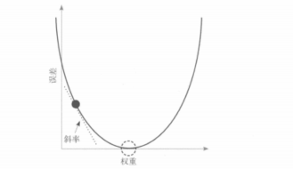

### 4. 斜率与代码行（务必对齐「½」）

1. **切线斜率** = **dLoss/dw** = 梯度（标量 **w** 时常不再区分「偏导」说法）。  
2. 若采用 **`Loss = ½·(pred − y)²`**（与 **`04` 第四节**「拆开算」同一约定），则 **∂Loss/∂w = (pred − y)·x = delta * input**，与 **`weight_delta = delta * input`** **完全一致**；此时 **`weight = weight - weight_delta`** 即 **`η = 1`** 的一步。  
3. 若 **`Loss = (pred − y)²`（无 ½）**，则 **∂Loss/∂w = 2·(pred − y)·x**；仍写 **`weight_delta = delta * input`** 时相当于少乘 **2**，可用**更小步长**或显式 **`w -= eta * 2 * ...`** 吸收（**`04` 第四节**末：常数只重标定 **η**）。  
4. **符号**：**dLoss/dw > 0** → 应**减小 w**；**< 0** → 应**增大 w**；**= 0** → 一阶驻点（此抛物线即碗底）。

「变化率里为什么能读方向」：**一元导数的正负**回答「**w** 往右微挪时 **Loss** 升还是降」，与更新方向一一对应；**绝对值**反映坡陡缓。

### 5. 与冷热学习划界

|  | 冷热学习 | 梯度下降（上段五代码骨架） |
|--|----------|---------------------------|
| 方向 | 试 **w±步长** 比 **Loss** | 用 **dLoss/dw**（或与其成比例的 **`weight_delta`**） |
| 步长 | 试探步与更新步绑死 | 可用 **`alpha`** 单独调；与梯度模长共同决定一步远近 |
| 前向次数 | 每步多次预测 | 通常每步一次 **pred** 即可算 **delta** |

### 6. 一句话

**入门标量版**：在 **Loss(w)** 这条「碗形」曲线上，用**梯度（切线斜率）**决定往哪挪 **w**；**`delta * input`** 在 **½** 损失约定下就是 **∂Loss/∂w**，与书中最简写法逐行对齐。

### 7. 手算四轮（`input = 0.5`，`goal_pred = 0.8`，初值 `w = 0.5`）

以下按 **`weight_delta = delta * input`** 且 **`w ← w − weight_delta`**，等价 **`Loss = ½(pred−y)²`**、**`η = 1`**（与 **`03`** 第六节 **`½`** 手算一步同一约定）。**`error = (pred−y)²`** 仍用**无 ½** 的平方，便于和 **`02`** 的 **0.3025** 对照。

| 轮次 | w | pred = 0.5·w | delta = pred−0.8 | weight_delta = delta·0.5 | 下一轮 w | error = (pred−0.8)² |
|------|---|----------------|-------------------|---------------------------|----------|---------------------|
| 0 | 0.500000 | 0.250000 | −0.550000 | −0.275000 | 0.775000 | 0.302500 |
| 1 | 0.775000 | 0.387500 | −0.412500 | −0.206250 | 0.981250 | 0.170156 |
| 2 | 0.981250 | 0.490625 | −0.309375 | −0.154688 | 1.135938 | 0.095713 |
| 3 | 1.135938 | 0.567969 | −0.232031 | −0.116016 | 1.251953 | 0.053839 |

四轮后 **w ≈ 1.252**，仍在最优 **w* = 1.6** 左侧；继续迭代沿抛物线向碗底靠近。若改为 **`w -= alpha * weight_delta`**（如 **`alpha = 0.01`**），每步更小，需更多轮，但仍是同一梯度乘学习率。

### 8. 书中另一例：`input = 1.1`，`goal_pred = 0.8`，初值 `weight = 0`（四轮与「过碗底」）

书中用下面循环（**`range(4)`**）演示**同一条五代码行**，但换了一组数：**`input` 较大**、**`weight` 从零起步**，第一步 **`weight_delta = delta * input`** 的绝对值会很大，**黑点会在误差碗上「一大步」跨到最优权重另一侧**，再靠后续几步把 **`pred`** 拉回 **`goal_pred`** 附近。最优仍满足 **`1.1·w* = 0.8`**，即 **`w* ≈ 0.727`**。

```python
weight, goal_pred, input = (0.0, 0.8, 1.1)

for iteration in range(4):
    print("-----\nWeight:" + str(weight))
    pred = input * weight
    error = (pred - goal_pred) ** 2
    delta = pred - goal_pred
    weight_delta = delta * input
    weight = weight - weight_delta
    print("Error:" + str(error) + " Prediction:" + str(pred))
    print("Delta:" + str(delta) + " Weight Delta:" + str(weight_delta))
```

**读图要点**（与上文「### 3. 核心几何」及 **`img/8.png`** 同一条碗形线）：

1. **第 1 轮**：**`w = 0`** 在碗**左侧高处**，切线斜率为**负**，**`delta = −0.8`**，**`weight_delta = −0.88`**，**`w ← w − weight_delta`** 等价**大幅增大 w**（向碗底方向走），**`error = 0.64`**。  
2. **第 2 轮**：**`w`** 已到 **≈0.88**，已超过 **w\***，点在碗**右侧**，斜率变**正**，下一步会**减小 w**（书中口语：步子迈大、从另一侧退一步）。**`error`** 已骤降到约 **0.028**。  
3. **第 3、4 轮**：在谷底两侧微调，**`|weight_delta|`** 随 **`|delta|`** 变小，切线趋平，**`pred`** 逼近 **0.8**，**`error`** 可到 **1e−4～1e−7** 量级（与书页打印一致）。

图 1：前两轮数值流 + 误差–权重曲线上的点与切线。

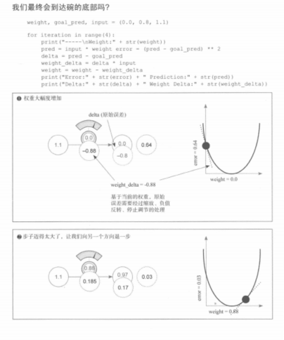

图 2：第 3–4 轮靠近谷底 + 四轮 `print` 汇总。

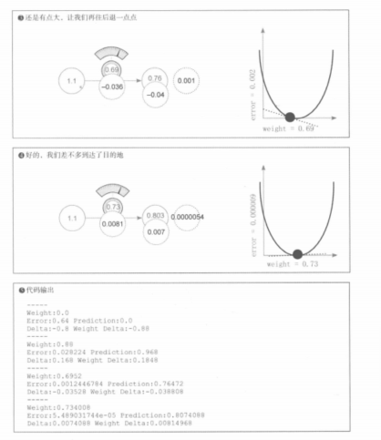

前两步的放大书页分镜见**下文第三节「§3」** **`img/14.png`、`img/15.png`**。

---

## 二、书中一例：脚趾数目 → 是否获胜（一次模拟更新）

下面四张图是**同一轮迭代**的切片：固定 **`(input, goal_pred) = (8.5, 1)`**，依次 **预测 → 平方误差与 delta → `weight_delta` → 用 `alpha` 写回权重**。**`weight_delta = input * delta`** 与 **`∂Loss/∂w = (pred−y)·x`** 同型；再乘 **`alpha`**，与 **`04` 第七节** **`w ← w − η·(∂Loss/∂w)`** 中 **`η`** 的角色一致（**`weight -= weight_delta * alpha`**）。

**① 初始网络与 `neural_network`**

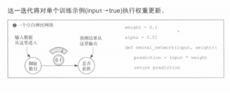

**② 预测、平方误差，以及 `delta = pred - goal_pred`**

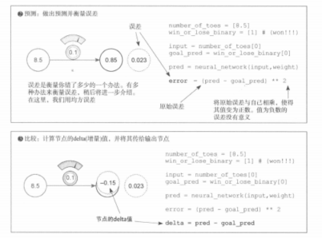

**③ `weight_delta = input * delta`（权重增量 / 与梯度同型）**

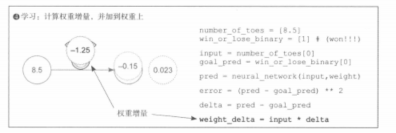

**④ `weight -= weight_delta * alpha`（新权重示意）**

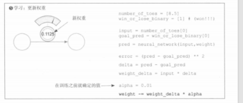

---

## 三、4.16～4.23：导数读法、梯度导航、收敛与「步长过大」发散

与**本篇第一节**（**`img/8`～`10`、`14`、`15`**）及 **`04` 第十、十一节**（符号与 **`w ← w − ηg`**）同一套符号。

### 1. 4.16：导数的两种通俗说法

1. **变化率**：只动 **w** 一点点时，**Loss**（书中常打印 **`error = (pred−goal)²`**）变快还是变慢——即 **dLoss/dw**。  
2. **几何**：固定 **x、y** 时，**Loss(w)** 是 **w** 上的 **U 形**（抛物线）；**某点的切线斜率**就是该点的导数（一元里即梯度）。

书中常固定 **`x = 0.5`**、**`y = 0.8`**，只看 **w** 如何影响误差，则 **`pred = 0.5·w`**，打印用的平方误差为：

**Loss(w) = (0.5·w − 0.8)²**

- 曲线**开口向上**；**碗底**在 **`0.5·w = 0.8`**，即 **`w* = 1.6`**，**Loss = 0**。  
- **w < w\***（最优左侧）：斜率 **< 0**；**w > w\***（右侧）：斜率 **> 0**；离碗底越远，**|dLoss/dw|** 一般越大（坡更陡）。

### 2. 4.17～4.19：导数 = 梯度下降要用的「导航」

1. **`weight_delta = delta * input`** 在 **`Loss = ½(pred−goal)²`** 约定下就是 **∂Loss/∂w**（见 **`04` 第四节**）；它**一个数里带两件事**：**符号**与**绝对值**。  
2. **更新规则**：**`w ← w − η · (∂Loss/∂w)`**；取 **`η = 1`** 时即 **`weight = weight - weight_delta`**。含义是：沿**梯度相反**方向走（**`04` 第十节**）。  
3. **对应代码骨架**（与**本篇第一节**一致）：

```python
delta = pred - goal_pred
weight_delta = delta * input      # 在 ½ 损失下即 ∂Loss/∂w
weight = weight - weight_delta    # 沿负梯度走一步（常再乘 alpha / 学习率）
```

### 3. 4.20：`input = 1.1` 时的「正常」观感

在 **`goal = 0.8`**、**`w` 从零起步**的书中例里（**第一节 §8**、**`img/9.png`、`img/10.png`**），**误差总体随迭代下降**，最后 **`pred`** 很接近 **`goal`**。注意：**第 2 步会略「跨过」碗底**；与「步长过大导致发散」是同一机制的两端：**本例还能收回来**，**`|input|`** 再大则可能收不回来。

下面两页与 **`img/9–10`** 同一 **`input=1.1`** 代码，更放大**前两步**：

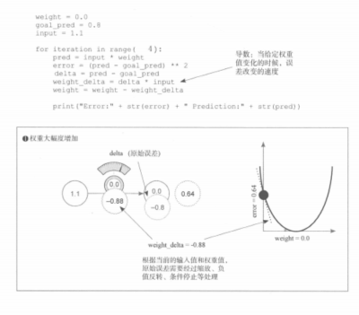

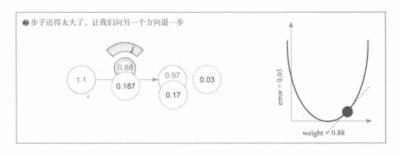

### 4. 4.21～4.23：步长过大 → 震荡加剧甚至「爆炸」

**现象**：把 **`input`** 调到 **2**（或更大）、仍用 **`w ← w − delta * input`** 且**不显式缩小学习率**时，**`|weight_delta|`** 放大；**w** 可能在碗两侧**来回弹跳**，**Loss** 不降反升，甚至出现 **inf / NaN**。

**原因**：**`∂Loss/∂w = (pred−y)·x`**，**`|x|`** 大则梯度模更大；**`η`** 仍偏大时一步位移过大 → **发散 / 不稳定**。

**几何直觉**：**`|x|`** 大时 **Loss(w)** 更「尖」，同一更新式下更易**迈过谷底刹不住车**。

**书中 `input = 2` 配图：**

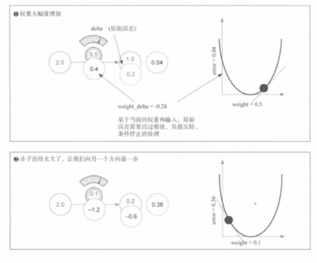

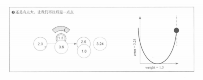

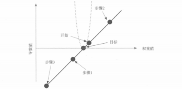

**出路**：**`w ← w − alpha * weight_delta`**，用 **`alpha`、`η ≪ 1`** 缩放步长；必要时归一化输入等。

### 5. 与全章笔记的衔接

| 位置 | 内容 |
|------|------|
| **`03`** | 冷热试探 |
| **`04`** | 链式、拆开算、更新式、符号与数值表（**第三～十三节**） |
| **`06_平方误差与对数损失_数值例题.md`** | 两套损失步步有数 |
| **本篇第一节** | **4.11**、**`img/8`～`10`、`14`、`15`** |
| **本篇第二节** | 脚趾四图 **`img/4`～`7`** |
| **本篇第三节** | **4.16～4.23**、**`img/11`～`13`** |

一句话：**导数告诉你下坡往哪迈；学习率决定每一步迈多大。**
