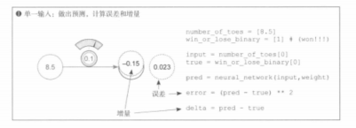
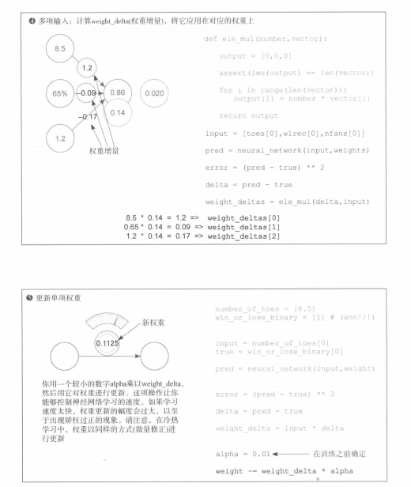
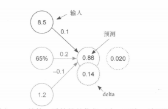
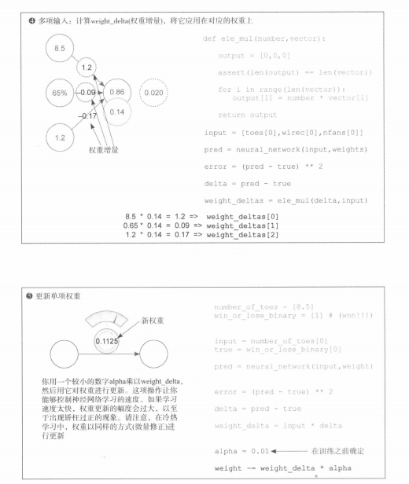
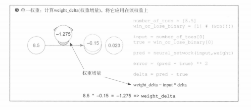

# 第5章预备 · 多输入神经网络：完整 4 步训练（一次迭代）

> 与第4章梯度下降闭环：**`04_梯度下降_Loss与对权重求导.md`**（**∂Loss/∂w**、**`w ← w − ηg`**）、**`05_书例图解_梯度与学习率.md`**（**delta**、**α**）、**`03_误差测量与冷热学习.md`**（误差驱动）对照阅读。多输入前向里的 **`w_sum`** 与 **`ele_mul`** 与第3章 **`ch03_forward_propagation/03_3.5_多个输入与加权求和.md`**、**`06_3.8_单输入多输出与逐元素乘法.md`** 同名思路一致（此处 **delta 为标量**，**ele_mul** 即「标量 × 向量」）。

---

## 图解 · 书中书页（对应步骤 1～4；**`img/1`～`img/8`** 按阅读顺序：**03 → 07 → 01 → 04 → 05 → 02 → 06 → 08**）

图中代码若出现 **`assert(len(a) == len(b))`**，请以本文 **`assert len(a) == len(b)`** 为准；**新权重**打印值与手算可能与浮点舍入略有出入，以 **`mult_input_one_step.py`** 为准。

**`img/1`** — 多输入空白网络、首场比赛前向、error/delta、ele_mul 与 weight_deltas（书中）


**`img/2`** — 学习：alpha 与按 weight_deltas 更新权重（书中）


**`img/3`** — **书中 ❶ 单输入**，与**步骤 2**同型：**`pred → error → delta`**。例：**`input=8.5`**、**`weight=0.1`**、**`true=1`** → **`pred=0.85`**、**`delta=−0.15`**；**`error=(pred−true)²=0.0225`**，图中 **≈0.023** 为约数。更完整的脚趾例分镜见 **`ch04_gradient_descent/05_书例图解_梯度与学习率.md`** 第二节。



**`img/4`** — **书中 ② 多输入**（**`pred=0.86`**、**`error≈0.020`**、**`delta=−0.14`**；图中增量圈有时标 **0.14**）



**`img/5`** — **②** 的另一分镜（与 **`img/4`** 对照）



**`img/6`** — **书中 ③ 单输入**：**`weight_delta = input * delta`**（**`8.5 × (−0.15) = −1.275`**）。与**步骤 3** **`ele_mul(delta, input_vec)`** 的**每个坐标**同型；书页序号与 **`ele_mul`** 多输入段落在本书中同属**第 5 章**脉络。


**`img/7`** — **书中 ④⑤ 合页**（多输入 ele_mul 与权重增量；单输入 alpha 与新权重）



**`img/8`** — **书中 ⑥**（**`ele_mul`**、**`alpha`**、**`for`** 逐项更新多项权重）



---

## 一、步骤 1：搭建多输入权重网络

**3 个特征输入** → 各绑定 **1 个权重** → **加权求和**得到标量预测（单输出）。

- **输入**：脚趾数目、胜负相关特征、粉丝数目（书中示例数：`[8.5, 0.65, 1.2]`）。  
- **权重**：`[0.1, 0.2, -0.1]`。  
- **输出**：是否获胜的**标量预测**（再与标签比误差）。

```python
def w_sum(a, b):
    assert len(a) == len(b)
    output = 0.0
    for i in range(len(a)):
        output += a[i] * b[i]
    return output


weights = [0.1, 0.2, -0.1]


def neural_network(input_vec, w):
    pred = w_sum(input_vec, w)
    return pred
```

---

## 二、步骤 2：前向预测 → 误差与 **delta**

1. 代入真实输入，**pred = 0.86**（**`8.5×0.1 + 0.65×0.2 + 1.2×(−0.1) = 0.86`**）。  
2. 标签 **true = 1**。  
3. 平方损失：**error = (pred − true)² = 0.0196**（文中常写作约 **0.020**）。  
4. **delta = pred − true = −0.14**（与第4章「节点 delta」同义；在 **½·MSE** 约定下，**∂Loss/∂pred = pred−true**，再链到各 **wᵢ**）。

```python
input_vec = [8.5, 0.65, 1.2]
true = 1.0

pred = neural_network(input_vec, weights)
error = (pred - true) ** 2
delta = pred - true
```

**书中「② 多输入：预测、误差与增量」分镜**（与篇首 **img/3**（❶ 单输入）同一 **`pred → error → delta`** 链路；**`toes[0], wlrec[0], nfans[0]`** 与 **`pred=0.86`**、**`error≈0.020`**；**delta** 代数值仍为 **−0.14**，图中增量圈有时标绝对值 **0.14**）：


---

## 三、步骤 3：每个权重的更新量（与多 **∂Loss/∂wᵢ** 同型）

**标量 delta** 与**输入向量**逐元素相乘，得到**每个权重一行**的增量（与 **`weight_delta = input * delta`** 在单输入时同构，这里是**对每个坐标各乘一遍**；篇首 **`img/6`** 书中 **③** 即单坐标一例）：

**权重增量第 i 分量 ≈ input[i] × delta**（与 **`04`** 第四节 **∂Loss/∂wᵢ = (pred−y)·xᵢ** 在 **½** 损失下一致）。

```python
def ele_mul(scalar, vector):
    assert len(vector) > 0
    return [scalar * vector[i] for i in range(len(vector))]


weight_deltas = ele_mul(delta, input_vec)
```

**数值：**

- **8.5 × (−0.14) = −1.19**  
- **0.65 × (−0.14) = −0.091**  
- **1.2 × (−0.14) = −0.168**

---

## 四、步骤 4：学习率 **α**，更新全部权重

与 **`05`** **第四节**一致：**沿负梯度方向只走 **α** 比例**，避免一步跨太大。

**新权重 = 旧权重 − α × 该权重的梯度增量**（此处梯度增量取 **`weight_deltas[i]`**）。

```python
alpha = 0.01

for i in range(len(weights)):
    weights[i] -= alpha * weight_deltas[i]
```

**书中「⑥ 更新多项权重」**（与本节 **`for`** 循环、下表手算为同一步；手算式里 **`1.19 × (−0.01)`** 等即 **`−α·weight_deltas[i]`**，与 **`delta = −0.14`** 时 **`weight_deltas[0] = −1.19`** 一致）：


若书页**左侧连线**第二条印成 **−0.201**，与 **`0.2 − α·(−0.091) ≈ 0.20091`** 及脚本打印不符，以 **`weights[i] -= alpha * weight_deltas[i]`** 与 **`mult_input_one_step.py`** 为准。

**本例一步之后（保留四位小数便于核对）：**

| 权重初值 | 更新量 **α·Δ** | 新权重 |
|----------|----------------|--------|
| 0.1 | −0.0119 | **0.1119** |
| 0.2 | −0.00091 | **0.20091** |
| −0.1 | −0.00168 | **−0.09832** |

（运行 **`mult_input_one_step.py`** 可复现上述浮点结果。）

篇首 **图解** 中的 **`img/7.png`** 上半与本节 **`ele_mul(delta, input_vec)`** 同型；图中手写 **×0.14** 多为 **`|delta|`** 示意，与代码 **`delta = −0.14`** 时应在乘积上保留负号，与上文 **「数值」** 列表一致。其下半单输入 **`weight -= weight_delta * alpha`** 与 **`ch04_gradient_descent/05_书例图解_梯度与学习率.md`** 第二节脚趾例同型。

---

## 五、与第4章一句话闭环

1. **单权重** → **多权重**：每个 **wᵢ** 各自一条 **input[i]·delta**，**并行**算完再一起更新。  
2. **delta = pred − true**：链式里对接 **∂Loss/∂pred** 的一段（再乘 **∂pred/∂wᵢ = xᵢ**）。  
3. **权重梯度（增量）** ∝ **输入 × delta**。  
4. **`weights[i] -= alpha * weight_deltas[i]`** 即 **`w ← w − η·∇L`** 的分量形式。  
5. 一次迭代：**前向 → Loss → delta → 各权重增量 → 带 α 更新**。

---

## 六、附录：完整可运行脚本

同目录 **`mult_input_one_step.py`** 与上文四步一致。在仓库根目录执行：

```bash
python ch05_general_gradient_descent/mult_input_one_step.py
```
