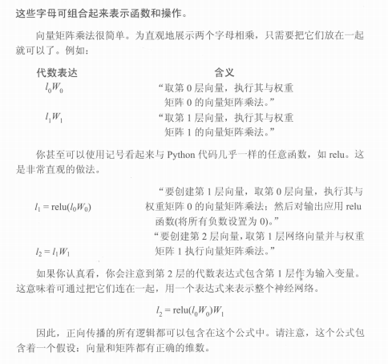

# 第7章：神经网络可视化与关联抽象
**Core Concept: Visual Simplification -> Relational Abstraction -> Symbolic Representation**

## 一句话讲透本章
第7章这一段的核心不是“调参”，而是：  
**把复杂网络从看不懂的连线图，逐步变成可读、可算、可沟通的可视化工具。**

---

## 一、本章主线（你说的这个顺序完全正确）

1. 先给一个**简化版网络图**（先让人能看懂结构）
2. 再讲**关联抽象**（每层到底在抽象什么关系）
3. 再指出旧画法的问题（画每条线会爆炸）
4. 然后给出**新的层级可视化**（层=向量，层间=矩阵）
5. 最后进一步抽象成**字母变量可视化**（`l0/l1/l2`, `w0_1/w1_2`）
6. 收束到信息整合：变量之间怎么连接、怎么传递

---

## 二、为什么这一章必须先讲“可视化”

网络一深、节点一多，旧方法（画满每条连接线）会立刻失效：
- 图会非常乱，读不出信息流方向
- 很难定位“这一层在干什么”
- 更难把图和公式、代码一一对应

所以这章先做的不是加新算法，而是换观察方式：
- 从“盯单条边”切到“盯层与层之间的变换”
- 从“图形细节”切到“结构与变量映射”

---

## 三、7.2 关联抽象（本质是层层信息整合）

### 1) 局部关联（浅层视角）
- 输入层到输出层，学的是直接相关
- 每层只在自己这一层范围内调整数值

### 2) 全局关联（深层 + 反向传播）
- 输出误差反向传回，每层都收到“该调大还是调小”的信号
- 每层更新都对齐同一个全局目标，而不是各干各的
- 结果是：底层到高层逐步抽象，形成更完整的关联表达

一句话：  
**关联抽象 = 前向整合信息，反向对齐目标，层层协同。**

---

## 四、7.3 可视化简化（从连线图到矩阵图）

### 旧画法（不适合深网）
- 每个节点、每条边都画出来
- 节点数一上去就不可读

### 新画法（本章关键工具）
- 一整层看成一个向量 `l`
- 层与层连接看成一个矩阵 `w`
- 于是网络主流程可直接写成：
  - `l1 = f(l0 · w0_1)`
  - `l2 = f(l1 · w1_2)`

这就是“结构图 -> 公式图 -> 代码图”的统一入口。

---

## 五、从图片可视化到字母可视化（进一步简化）

你提到的这个点非常关键：  
**最后不是继续画更复杂图片，而是改用字母系统表达网络。**

常用映射：
- `l0`：输入层向量
- `w0_1`：输入到隐藏层权重矩阵
- `l1`：隐藏层向量
- `w1_2`：隐藏到输出层权重矩阵
- `l2`：输出层向量

这样做的好处：
- 一眼知道变量角色
- 可直接转公式、转代码
- 便于追踪信息流和梯度流

下面这张图就是“从层变量到公式表达”的直观示例：

---

## 六、本章图示资源（你现在这套图可以直接串起来）

- 结构总览图：`img/network_overview_dual_style.png`
- 层叠简化图：`img/layer_stack_structure.png`
- 矩阵向量图：`img/matrix_vector_structure.png`
- ReLU 结构图：`img/relu_layer_structure.png`
- ReLU 流程图：`img/relu_step_flow.png`
- 变量标注图：`img/weights_vectors_label_map.png`
- 字母表达式示例图：`img/symbolic_expression_example.png`

建议阅读顺序：
1. 先看 `network_overview_dual_style.png`（总览）
2. 再看 `layer_stack_structure.png`（简化）
3. 再看 `matrix_vector_structure.png`（向量/矩阵视角）
4. 最后看 `weights_vectors_label_map.png`（字母变量映射）

---

## 七、和第6章的关系（承接）

- 第6章重点：网络如何训练（前向、反向、更新）
- 第7章这段重点：网络如何表达与解释（可视化与抽象）

第6章解决“能不能学”，  
这一段解决“怎么看懂它在学什么”。

---

## 八、本段核心结论（收束）

- 这章这部分首先是**可视化工具升级**，不是先上新优化算法
- 简化图的目标是让网络结构和信息流可读
- 关联抽象的目标是解释“每层如何共同表达全局规律”
- 用字母替代图片细节，是为了把图、公式、代码统一到一套表示系统
