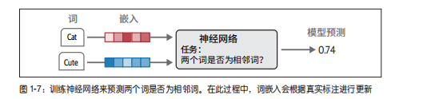
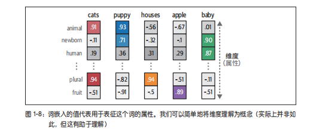
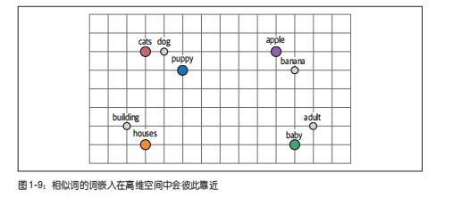

# 词向量终极总结

## 1. 什么是词向量
- 把一个单词转换成一组固定长度数字。
- 这组数字就是词向量（词嵌入，Embedding）。
- 目的：让神经网络可以处理单词与语义关系。

---

## 2. 维度由谁决定
- 维度 = 这组数字的长度。
- 维度由人设定（超参数），不是模型自动决定。
- 常见维度：`100`、`128`、`256`、`300`。

---

## 3. 维度数量 = 特征数量
- 1 个维度可以看作 1 个隐藏特征槽。
- 100 维表示有 100 个特征槽位。
- 维度越高，表达容量通常越强，但计算成本也更高。

---

## 4. 每个维度代表什么
- 每个维度对应一种隐藏特征倾向（如情感、语法、语义角色等）。
- 这些维度含义通常不是人工逐个命名的，而是模型从数据中学习出来的。
- 人工决定“开多少槽位”，模型决定“每个槽位学什么”。

---

## 5. 词汇量由谁决定
- 词汇量 = 训练语料中去重后的单词总数（按词表构建规则）。
- 如果词表里有 10000 个词，就有 10000 行词向量参数。
- 每个词都有自己对应的一条向量。

---

## 6. 词向量训练目标
核心目标是：

**让语义相近、上下文可替换的词在向量空间更靠近。**

例如：
- `good / great / excellent`
- `cat / dog / pet`
- `king / queen / prince`

---

## 7. “靠近”到底代表什么
- 向量距离近：语义更相似。
- 语义更相似：在很多上下文里更容易互换。

例如：
- `I have a cat` 与 `I have a dog` 语义框架接近。
- `The king came` 与 `The queen came` 句式与语义角色接近。

---

## 8. 为什么能做向量加减
示例：`king - man + woman ≈ queen`

直觉是：
- 语义空间里学出了某些稳定方向（如性别方向、时态方向等）。
- 向量加减相当于在语义空间沿方向移动。
- 如果空间结构学得好，就会出现可解释的类比关系。

---

## 最精简背诵版
**词向量是单词的数字表示；维度是人定的，维度数就是特征槽数量；每个特征由模型从数据中自学；词汇量由语料词表决定；训练目标是让可替换词在向量空间更靠近；靠近意味着语义相似。**

---

## 图示补充

### 1) 训练目标示意

### 2) 维度含义示意

### 3) 向量空间邻近关系

